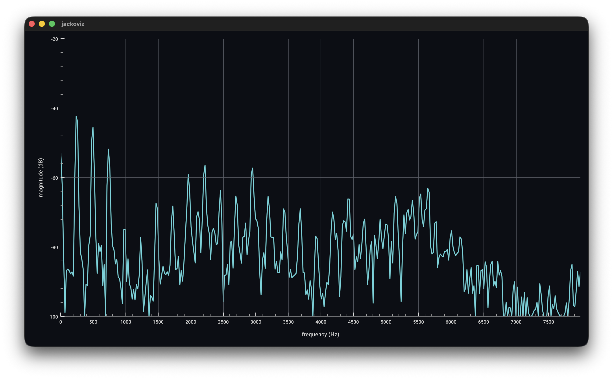
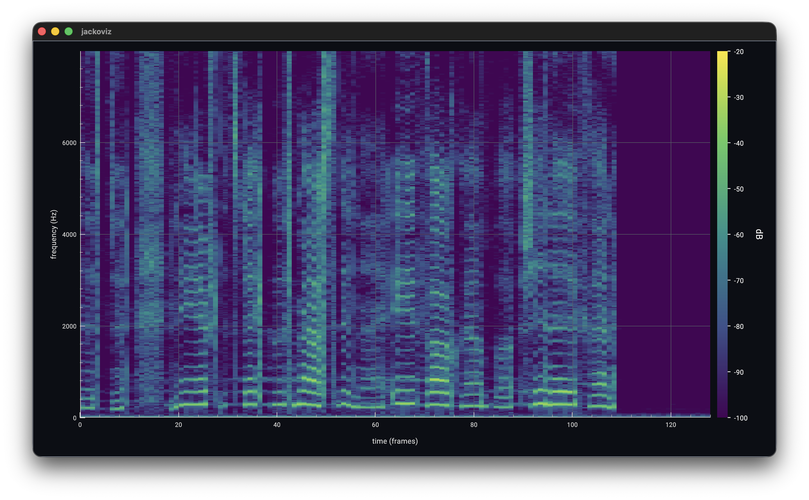

# jackoviz

Scientific visualization of audio signals.
Realtime mono audio → Kaiser-windowed FFT → 3D Datoviz spectrogram.

Screenshots (Suzanne Vega singing Tom's Diner):





## Pipeline

1. **JACK** process callback writes one input channel into a lock-free `jvz_jack_ringbuffer`.
2. On each Datoviz frame, read a FFT sized number of samples from our jvz_jack_ringbuffer, then process a **Kaiser-windowed** real FFT with **FFTW3**.
3. Magnitude spectra (dB, normalized) are appended as columns into a **bidimensional doubly-mapped** ringbuffer (time × frequency), so a wrapping history can be read as one contiguous block.
4. That history drives a Datoviz **`dvz_geometry_surface_grid`** mesh, updated every frame.

## Requirements

| Dependency | Notes |
|---|---|
| JACK | `pkg-config jack` — jackd must be running |
| FFTW3 | `pkg-config fftw3` |
| Datoviz ≥ 0.4 | Set `DATOVIZ_ROOT` to a built checkout, or use `datoviz-config` |
| POSIX | macOS / Linux (`shm_open` + mirrored `mmap`) |

## Build

First, clone and build [Datoviz](https://datoviz.org/) v0.4.0. Requires CMake ≥ 3.20, JACK, FFTW3, and (by default) protobuf + gRPC for the controller.

```bash
cmake -S . -B build -DDATOVIZ_ROOT=$HOME/work/datoviz
cmake --build build

# optional: disable the gRPC control plane
# cmake -S . -B build -DDATOVIZ_ROOT=$HOME/work/datoviz -DJVZ_ENABLE_GRPC=OFF
```

`jvzcontroller.proto` is compiled into C++ gRPC stubs under `build/generated/` during the build.

## Run

```bash
# jackd must already be running
./build/jackoviz                         # connect manually in QjackCtl / jack_connect
./build/jackoviz -f 6000                 # set the maximum plotted frequency
./build/jackoviz -s system:capture_1     # auto-connect capture
./build/jackoviz -n 8192 -b 6.0          # longer FFT, sharper Kaiser window
./build/jackoviz --frames 120            # smoke: exit after 120 frames
./build/jackoviz --fast                  # scope + 1D spectrum only (lighter CPU)
./build/jackoviz --rpc-only              # disable keyboard settings (gRPC / remote only)
```

With gRPC enabled, the app also listens on `0.0.0.0:50051` for `JvzController` RPCs (see `jvzcontroller.proto`).

**`--rpc-only`** ignores all keyboard setting shortcuts so control comes only from gRPC (intended when launched from `jackoviz-remote`).
## Remote controller

Qt Quick UI that launches a sibling `jackoviz` via `fork`/`execve` with `-n`,
optional `--fast`, and `--rpc-only`. The JACK port dropdown is filled from a
live `jackoviz-remote` JACK client (`jack_get_ports` audio outputs). Runtime
controls (view, max freq, dB range, Kaiser β, line width, pause) and Quit use
gRPC `JvzController` on `127.0.0.1:50051`.

```bash
cmake --build build --target jackoviz-remote
./build/jackoviz-remote   # expects ./build/jackoviz next to it; jackd must be up
```

Press key **0** for a basic scope, **1** for a real-time STFT frequency–magnitude analyzer, **2** for a spectrogram, **3** for a 3D spectrogram. Look at the top of the C file to adjust some constants to your taste, rebuild afterwards.

Keyboard controls:

- **f** / **c** — cycle the plot dB floor and ceiling
- **m** — cycle max plot frequency through 8 / 12 / 16 / 20 / 4 / 6 kHz (disabled if you passed **`-f`** on the command line)
- **w** — toggle the oscilloscope and 1D spectrum line width between 1 and 2 pixels
- **p** — pause/resume visual processing (FFT and plot uploads); the JACK callback keeps writing the audio ringbuffer, and the current view stays frozen until resume

**`-f hz`** locks the maximum plotted frequency to `hz` and turns off runtime frequency cycling on key **m**.

**`--fast`** skips the 2D and 3D spectrogram panels and their per-frame uploads (`upload_spectrogram`), keeping only the oscilloscope and 1D spectrum views. Keys **2** and **3** do nothing in this mode; the app starts on the 1D spectrum.

Drag in the window to orbit the surface (arcball). Close the window to quit.

The time resolution is, using our customized jack ringbuffer, finer when using a small (64, 128 or 256 samples) jack audio buffer depth.

## Layout of the spectrogram ringbuffer

- Capacity: 256 time columns (power of two), each with `fft_size/2+1` bins.
- Backing store: one shared-memory region of `capacity × bins × sizeof(double)` bytes, **mapped twice** into a contiguous `2×` virtual range.
- Pushing a column writes at `write_col % capacity`; reading the last *H* columns uses the mirror so the view never needs a wrap copy.
